# Reelscape React App

This is the full-stack-ready Next.js source tree for the Movie & Entertainment Platform PRD.

[](https://github.com/Gautam215/Music-and-Movies-show/actions/workflows/ci.yml)
[](https://music-and-movies-show.vercel.app/)

## Showcase

The live UI is available at [music-and-movies-show.vercel.app](https://music-and-movies-show.vercel.app/).
Run `npm run screenshots` against a production server on `localhost:3000` to refresh the desktop and mobile captures below.

### Home

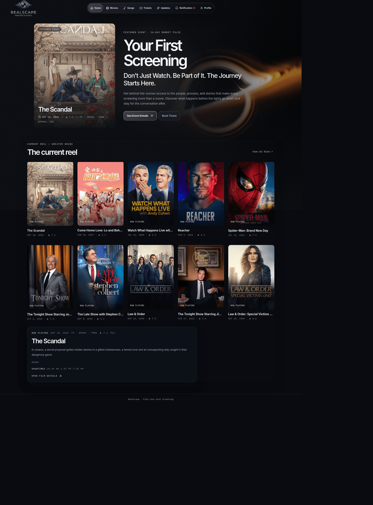
Black Hole hero and featured screening on Home (desktop).

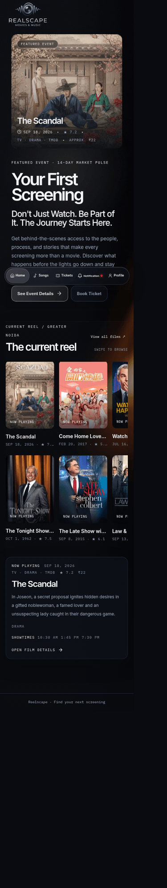
Black Hole hero and featured screening on Home (mobile).

### Songs

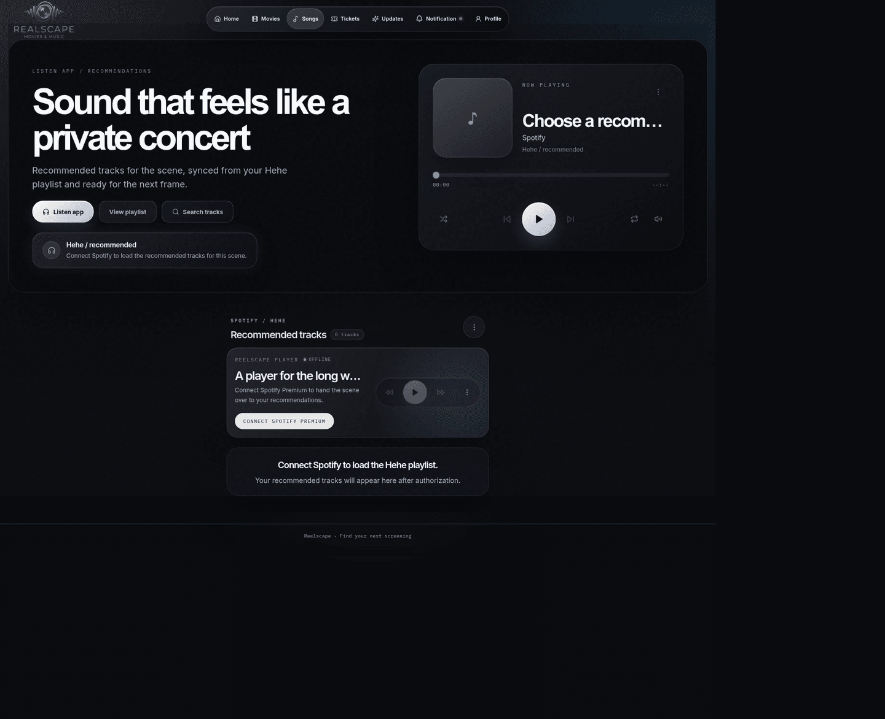
Spotify soundtrack player and recommendations on Songs (desktop).

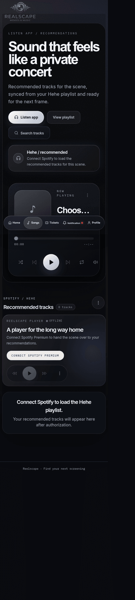
Spotify soundtrack player and recommendations on Songs (mobile).

### Tickets

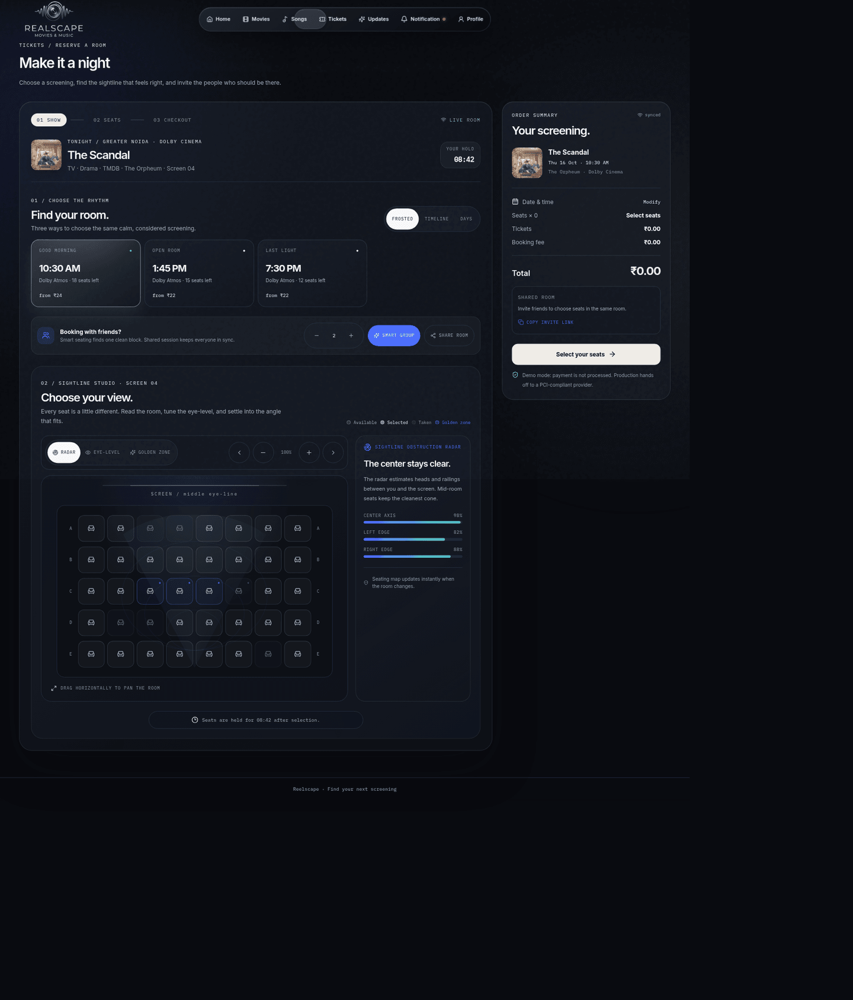
Showtime selection and interactive seat map on Tickets (desktop).

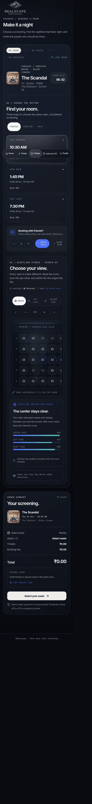
Showtime selection and interactive seat map on Tickets (mobile).

### Profile

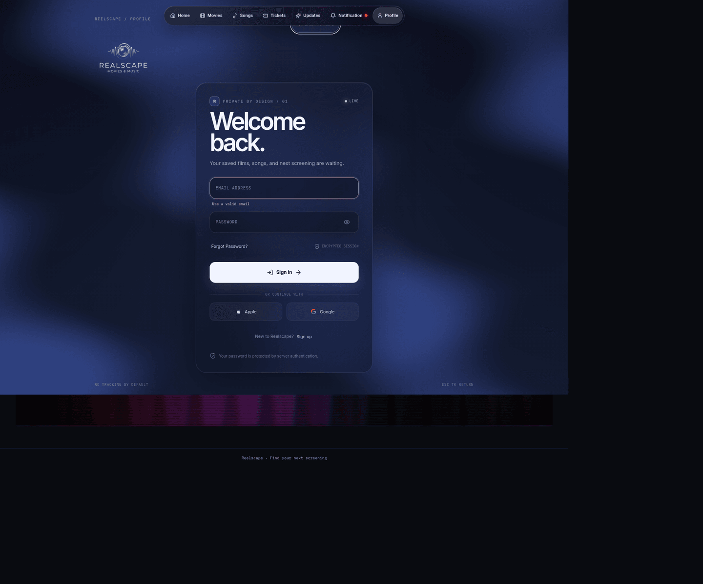
Personal signal and saved content on Profile (desktop).

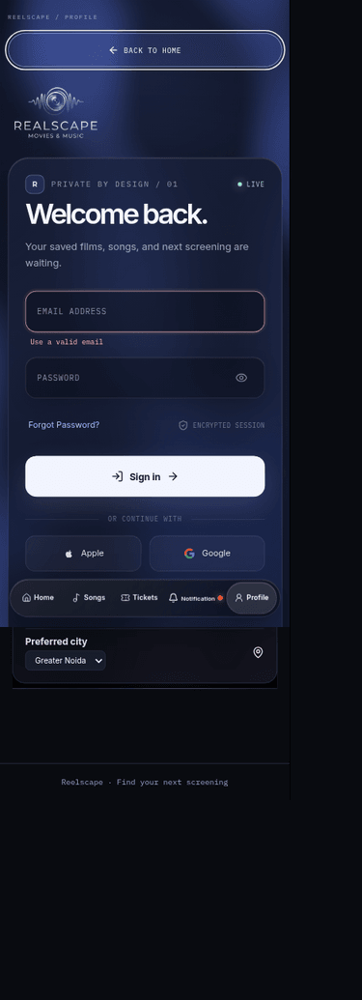
Personal signal and saved content on Profile (mobile).

## 3D Theater

The Three.js view maps the existing seat labels and states into a small cinema for signed-in users. Anonymous visitors keep the 2D seat map and can sign in to use 3D. Both views use the same booking actions, and the 2D map remains available if WebGL is unavailable.

The ticket screen resolves a YouTube preview for the selected title from TMDB. If TMDB has no usable video, the optional YouTube Data API fallback runs only when `YOUTUBE_API_KEY` is configured and it finds one unambiguous, public, embeddable title/year match. Otherwise, the screen reports that no preview is available. The iframe is shown on the CSS3D screen in seat POV or Screen view when a seat is selected; playback starts only when the viewer presses YouTube's player controls. The renderer listens for playback state to dim the room lights.

**3D runtime: NOT VERIFIED.** The opt-in development fixture and authenticated sample seat-map API were validated locally, but the cloud browser could not reach the local development server. The public site showed only its existing 2D ticket surface. The diagrams and implementation notes below describe the source; they are not claims of completed 3D browser testing.

For local QA only, set `ENABLE_PREMIUM_TEST_FIXTURE=true` and run `npm run dev`. In that same browser, activate the fixture with `fetch('/api/dev/premium-fixture', { method: 'POST' })` and reload the page. The fixture models an authenticated account with paid membership inactive, so it verifies that 3D access is tied to sign-in rather than membership. Sign out or send `DELETE` to the same endpoint to clear it. The route also requires `NODE_ENV=development`; it returns 404 otherwise. The fixture uses an in-memory, one-hour cookie, does not create a user/session/payment record, serves unclaimed sample seats, and cannot save favorites, viewing history, or bookings.

### 1. Full Flow

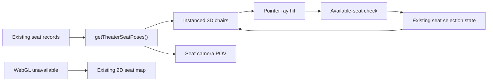

The renderer maps each stable seat label, row, column, and tier to a theater-world position and rotation. This keeps the curved 3D layout separate from the flat positions used by the 2D map and booking flow.

### 2. Room Build

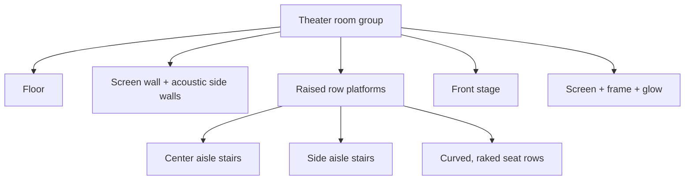

The same row layout sets seat height, platforms, and stair steps. Stair edges use low-emission light so the dark room stays readable.

### 3. Seat Build

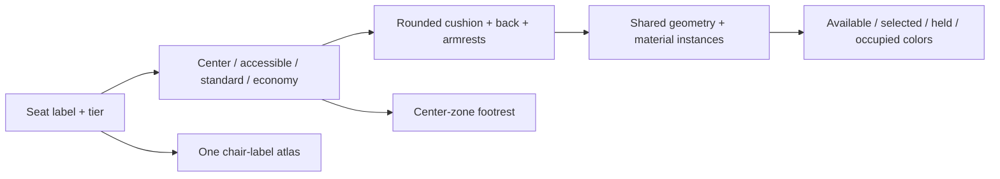

Seats share geometry and materials instead of creating a separate mesh for every part. Center-zone seats include a footrest. Accessible seats are slightly wider; seat colors communicate availability and selection consistently across all zones.

### 4. Camera and Seat POV

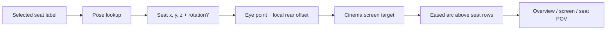

Each seat gets its own camera position from its theater pose and orientation. The camera aims at the screen. Transitions lift above the chair rows before settling into the next view; reduced-motion mode skips the animation.

### 5. Interaction

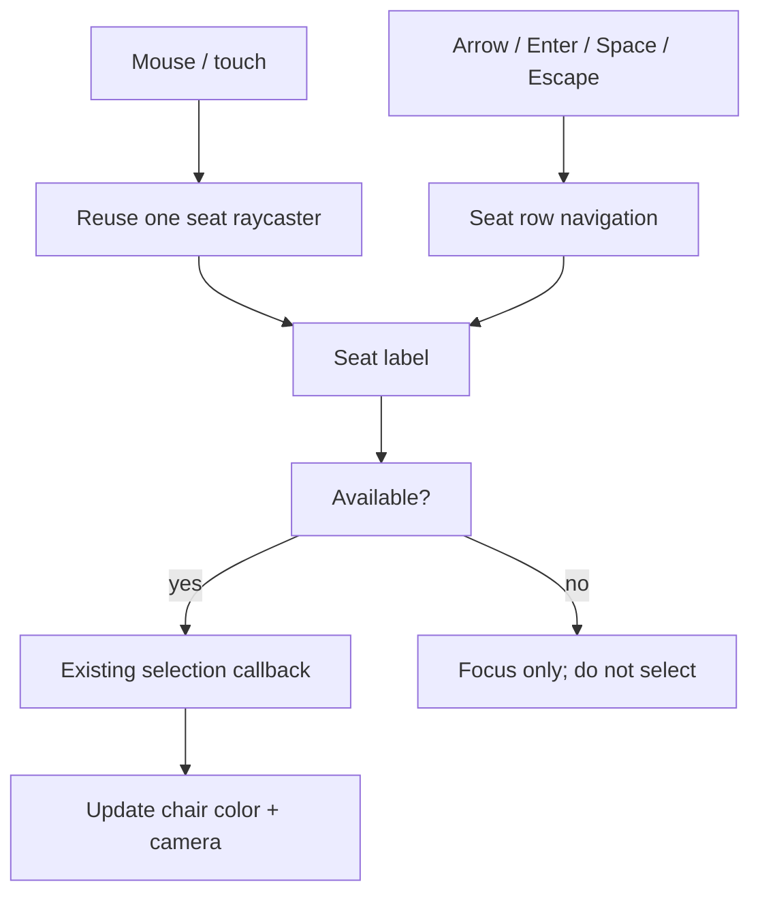

The pointer ray covers cushions, backs, footrests, and armrests. Held or occupied seats may be viewed but cannot be selected. Touch drag and pinch use the same orbit controls.

### 6. Light and Sound

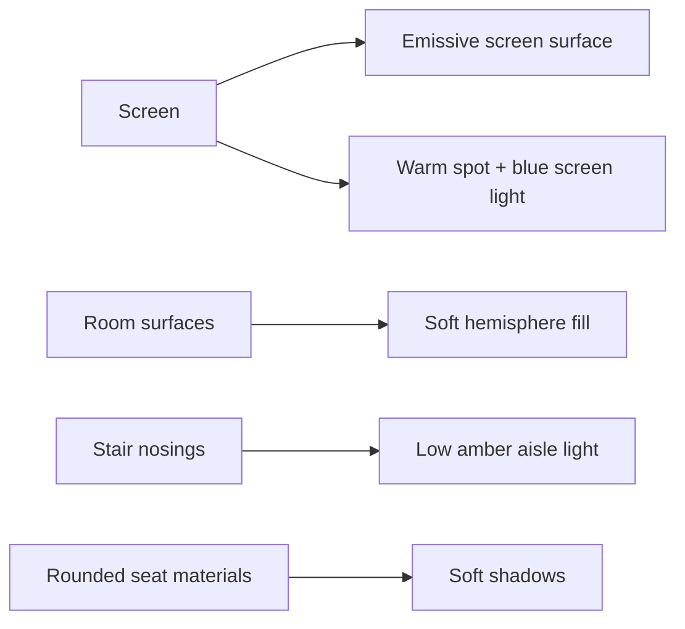

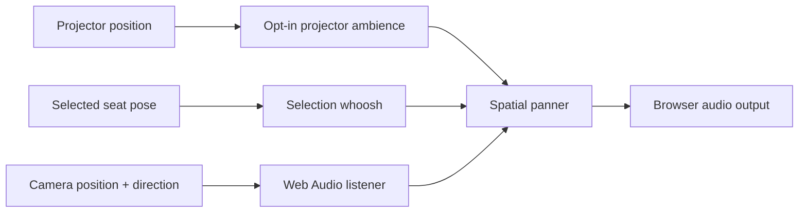

The ambience and seat-selection cues use the browser's Web Audio API. Ambience is optional and starts only after the user presses its control. Trailer video runs inside the YouTube iframe on the screen, so its audio stays under YouTube's control and is not routed through the Web Audio spatial panner. Only the local ambience and selection cues are spatialized. The iframe's playback-state messages drive the scene-light dimming; this behavior is implemented but not browser-verified yet.

### 7. Responsive Behavior

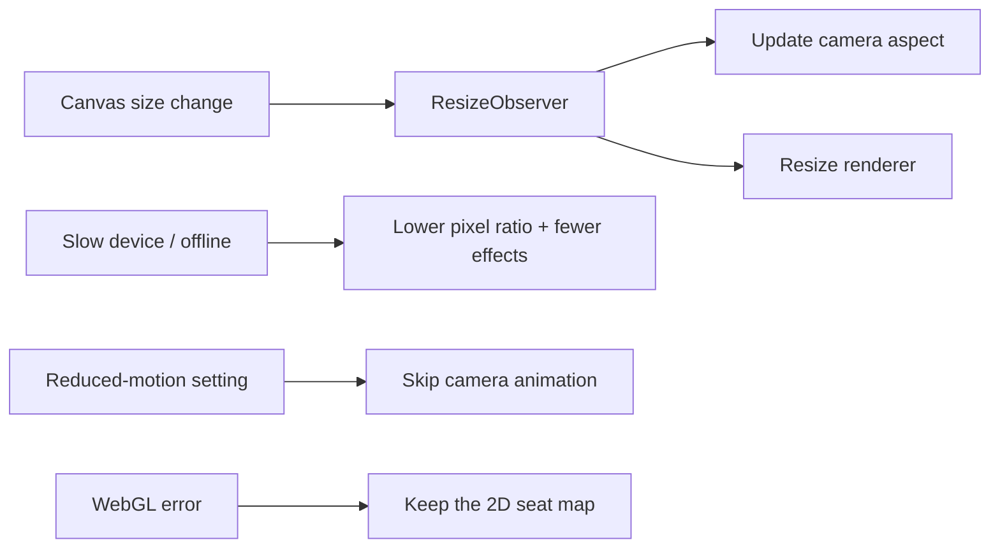

The canvas follows its container. Lower quality keeps the seat map and controls usable. The 2D view remains the fallback if the graphics context fails.

### 8. Code and Checks

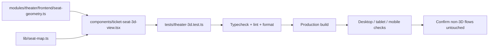

The geometry helpers are plain TypeScript, so seat positions, camera aim, row rise, seat colors, and camera easing can be tested without loading WebGL. Three.js, the CSS3D screen, player integration, lighting, and interactions live in the lazy-loaded view.

## Stack

- Next.js App Router with TypeScript strict mode.
- Tailwind CSS with shadcn-compatible `components/ui` primitives.
- `lucide-react` for interface icons.
- Three.js for the lazy-loaded 3D theater.
- Convex schema and transactional seat-hold functions under `convex/`.
- MongoDB-backed email/password authentication under `app/api/auth/`.
- Two-week TMDB featured screening plus a separate daily Current Reel across movies, TV, and anime with regional guest fallback and logged-in viewing-history personalization.
- Ticket trailers use TMDB first; the optional YouTube Data API fallback requires `YOUTUBE_API_KEY` and a single confident title/year match.
- Works Wheel from 21st.dev at `components/ui/works-wheel.tsx`.
- Black Hole visual system at `components/ui/black-hole-hero-section.tsx`, used as the global hero language.

## Run

```bash
npm install
npm run dev
```

Open `http://localhost:3000`.

## Screenshots

The screenshot script covers Home, Songs, Tickets, and Profile at 1440px desktop and 375px mobile widths.
Install Chromium once before running it locally:

```bash
npx playwright install chromium
npm run build
npm run start
npm run screenshots
```

Set `BASE_URL` to capture another running deployment, for example `BASE_URL=https://music-and-movies-show.vercel.app npm run screenshots`.

## Why `components/ui`

The Works Wheel imports the shared `cn` helper through `@/lib/utils`, and `components/ui` is the conventional shadcn location for portable primitives. Keeping it there makes future `shadcn add` commands and generated imports work without path changes.

## Backend Boundary

The 2D fallback keeps a deterministic local base map, while any authenticated user can request validated live claims through `/api/tickets/seat-map` for the 3D view. Checkout posts only the selected show and seat labels to `/api/tickets/confirm`, which writes unique MongoDB seat claims and returns a booking code; payment remains provider-hosted and is not processed by this demo. `convex/schema.ts` and `convex/bookings.ts` remain the first production seam for authenticated seat holds, expiry, movies, shows, songs, reviews, and orders. Connect `NEXT_PUBLIC_CONVEX_URL`, then replace the MongoDB ticket claim route with Convex hooks before launch. Payment should use signed webhooks and idempotency.

## Verification

Run the complete local verification pipeline after installing dependencies:

```bash
npm ci
npm run format:check
npm run typecheck
npm run lint
npm test
npm run build
npm run test:api
npm run audit
```

`npm run test:api` starts the production build on an isolated local port and checks public pages, rate-limit headers, authentication boundaries, Spotify error responses, and cross-origin request rejection. It should run after `npm run build`.

The unit tests use Node's built-in test runner. They cover same-origin checks, safe retries, fallback rate limits, theater geometry, individual seat POV, camera transitions, seat navigation, and trailer selection.

## CI/CD

`.github/workflows/ci.yml` runs formatting, type-checking, lint, dependency audit, unit tests, the production build, API regression checks, and UI screenshot capture for pushes to `main` and pull requests. The Vercel preview job runs after those checks for same-repository pull requests. The production job runs only after every check is green on a push to `main` and uses the Vercel CLI explicitly, so deployment failures fail the workflow.

The deployment jobs require these GitHub Actions secrets under **Settings → Secrets and variables → Actions**:

- `VERCEL_TOKEN`: a Vercel access token with deployment permission.
- `VERCEL_ORG_ID`: the Vercel team or account ID that owns the project.

The workflow links the `music-and-movies-show` Vercel project by name, so a project ID secret is not required. Never commit these values or put them in `.env` files. Pull requests from forks intentionally skip the preview deployment because GitHub does not expose repository secrets to untrusted fork workflows.

## Stack Inventory

- Languages: TypeScript, TSX, JavaScript, ECMAScript modules, CSS, HTML, JSON, YAML, Markdown.
- Frontend: Next.js 16 App Router, React 19, Tailwind CSS 3, Lucide React, shadcn-compatible UI utilities, CSS animations, Spotify Web Playback SDK integration.
- Backend: Next.js Route Handlers and middleware proxy, Node.js 22 runtime, MongoDB Node driver, Convex schema/mutations, scrypt password hashing, opaque httpOnly cookie sessions.
- External services: TMDB, OMDb, Spotify Web API, Spotify OAuth/PKCE, and optional Upstash-compatible Redis rate limiting.
- Tooling: npm lockfile, TypeScript compiler, ESLint 9 with `eslint-config-next`, Prettier 3, Node test runner, Next.js production server, GitHub Actions, Dependabot.
- Deployment boundary: the app is a standard Next.js deployment; environment variables in `.env.example` are server configuration and must be supplied by the deployment platform.

## API Rate Limiting

Every `/api/*` request passes through `proxy.ts`. The proxy uses one atomic Redis Lua `EVAL` script to increment a per-client fixed-window counter and set its expiry without race conditions. It works with any Upstash-compatible Redis REST endpoint.

Configure `UPSTASH_REDIS_REST_URL` and `UPSTASH_REDIS_REST_TOKEN` in the deployment environment. The defaults allow 120 requests per client per 60 seconds; override them with `RATE_LIMIT_MAX_REQUESTS` and `RATE_LIMIT_WINDOW_MS`. Set `RATE_LIMIT_FAIL_CLOSED=true` when Redis outages must reject API traffic with `503` instead of temporarily allowing it.

## Authentication

Set `MONGODB_URI` and optionally `MONGODB_DB_NAME` before using `/register`. The form creates users in the `users` collection and stores only scrypt password hashes. Login sessions are opaque, httpOnly cookies backed by the `sessions` collection. The Google button stays disabled until a Google OAuth provider is configured.

Browser API calls use `lib/client-fetch.ts`, which retries transient failures and `429` responses with exponential backoff, jitter, and the server's `Retry-After` value when present.

## Spotify Token Management

Spotify user tokens remain in `httpOnly` cookies. Server routes share one token manager that refreshes an expired access token once per request, persists rotated refresh tokens, caches client-credentials tokens in memory, spaces upstream requests, coordinates concurrent refreshes, and retries transient Spotify responses with exponential backoff while honoring `Retry-After`. The browser throttles session and playlist refreshes, and `429` responses are returned with their retry window so the UI does not immediately hammer Spotify again.
