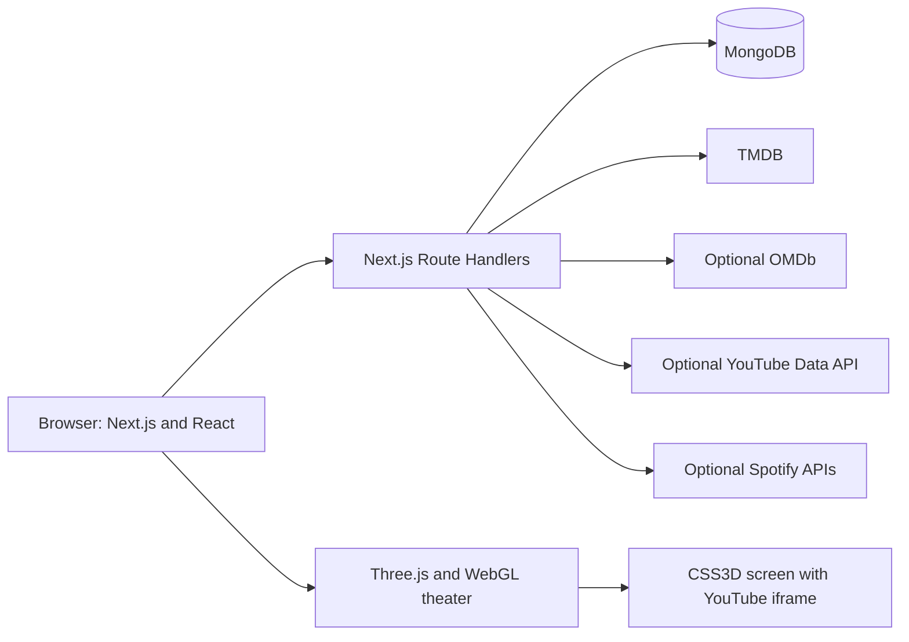

# Reelscape

[](https://github.com/Gautam215/Music-and-Movies-show/actions/workflows/ci.yml)
[](https://music-and-movies-show.vercel.app/)

Reelscape is a Next.js movie-discovery and cinema-ticket experience. It combines film browsing, saved titles, a 2D seat map, a sign-in-gated Three.js theater, and trailer previews positioned on the theater screen. Optional soundtrack features connect to Spotify when configured.

## Overview

- Browse movie, television, and anime catalogs, open details, save favorites, and share a movie from the current page.
- Choose a screening and seats in the 2D booking view, or use the sign-in-gated 3D seat theater.
- Load a selected title's trailer inside the 3D booking flow instead of a separate Watch Trailer action in movie details.
- Use MongoDB-backed email/password accounts, sessions, user signals, and confirmed seat claims.
- Browse soundtrack features with optional Spotify OAuth and API credentials.

## Screenshots

These checked-in captures cover the main app surfaces; the automated capture script does not authenticate or render the 3D theater.

| Surface | Desktop                                                | Mobile                                               |
| ------- | ------------------------------------------------------ | ---------------------------------------------------- |
| Home    | [home-desktop.png](screenshots/home-desktop.png)       | [home-mobile.png](screenshots/home-mobile.png)       |
| Songs   | [songs-desktop.png](screenshots/songs-desktop.png)     | [songs-mobile.png](screenshots/songs-mobile.png)     |
| Tickets | [tickets-desktop.png](screenshots/tickets-desktop.png) | [tickets-mobile.png](screenshots/tickets-mobile.png) |
| Profile | [profile-desktop.png](screenshots/profile-desktop.png) | [profile-mobile.png](screenshots/profile-mobile.png) |

## Core Features

### Movie Experience

- Discover films, television, and anime using TMDB feeds when `TMDB_READ_ACCESS_TOKEN` is configured, with curated and optional OMDb fallbacks.
- Open a movie detail dialog, book tickets for the selected movie, save or unsave it, and share it through the Web Share API or clipboard.
- Movie saves and viewing history persist for signed-in users. Guest saves are temporary UI state.
- Sharing uses the current page URL; it does not generate a unique permalink for each movie.
- The movie detail dialog has no Watch Trailer button. Trailer playback belongs to the 3D ticket flow below.

### 2D Booking

- Choose a movie, a listed day and showtime, and seats from the 2D seat map.
- The base map contains 40 deterministic sample seats across rows A-E. Its initial availability and the displayed schedule/prices are not supplied by a cinema inventory service.
- Guests can use the 2D surface; the server requires a signed-in account to confirm a booking.
- Confirmation writes a booking code and seat claims to MongoDB. Selecting a seat does not create a server-side expiring hold; the countdown shown in the UI is not a payment or inventory guarantee.
- The checkout form is demo UI. No payment provider is called and no payment is processed. Do not enter real card details.

### 3D Theater

The 3D view is available to signed-in users. The current server model sets `canAccess3DTheater` for every authenticated account; paid membership or premium-tier entitlement is not enforced.

- Five curved, raked rows use raised platforms, center/side aisles, and stairs. Seat geometry includes cushions, backs, armrests, labels, and zone-specific details.
- Available, selected, held, and occupied seats have distinct colors. A pointer hit-test maps clicks and taps to the same seat-selection state used by the 2D flow.
- Each seat has its own eye-level camera pose aimed at the screen. The overview, selected-seat POV, and screen view are joined by eased camera transitions; reduced-motion mode skips those transitions.
- Mouse and touch drag orbit the room; two-pointer touch adjusts the view. Arrow keys move seat focus, Enter or Space selects/removes an available seat, and Escape returns to the overview.
- The canvas resizes with its container. The renderer can reduce quality when performance is low or the browser is offline. If WebGL is unavailable or fails, the 2D seat map remains available.

### Trailer Playback

```text
Movie -> Book Ticket -> 3D -> Select Seat -> Seat POV -> Play trailer on the cinema screen
```

- With a TMDB token configured, the trailer API first checks videos for the selected TMDB movie or TV ID.
- If TMDB has no usable YouTube trailer, the server may use the YouTube Data API only when `YOUTUBE_API_KEY` is configured and a title is available.
- YouTube fallback candidates must match the selected title, have no conflicting release year, be public, processed, embeddable, and not region-restricted. Ambiguous best matches are rejected; unmatched trailers are not shown.
- When no reliable trailer is found, the screen reports: `No preview is available for this title.`
- The YouTube iframe is aligned to the physical cinema screen using the CSS3D renderer. It is not a full-page video overlay or a WebGL video texture.
- Playback is user-started (`autoplay=0`). Changing seats or moving between seat POV and screen view keeps the same trailer iframe when the selected movie/video is unchanged. Returning to the overview hides and clears the active player.
- YouTube player-state messages dim and restore the theater lights. This behavior is present in source, but has not been verified in an authenticated 3D browser session.

### Cinema Rendering

Three.js renders the room, curved seat layout, raised platforms and stairs, screen wall, physical screen frame, screen glow, lights, and shadows. A separate CSS3D layer places the interactive YouTube iframe on the screen surface, in alignment with the screen mesh. The iframe therefore moves with the theater camera rather than covering the page as a conventional video overlay.

The scene is lazy-loaded and uses WebGL. Resize handling updates the renderer and camera; reduced-quality mode lowers rendering cost, and WebGL failure leaves the 2D seat map as the fallback.

### Audio

- The optional projector ambience is synthesized with Web Audio oscillators and routed through an HRTF panner located at the screen. The audio listener follows the active 3D camera.
- When the ambience audio context is active, selecting a seat can play a short synthesized whoosh panned at that seat.
- Ambience starts only after the user activates its control, which also satisfies browser audio-start restrictions. Oscillators, panners, the audio context, iframe, and event listeners are cleaned up when the view is disposed.
- Trailer audio stays inside the cross-origin YouTube player. It is not routed through the Web Audio panner and is not spatialized by this application.

## Backend Architecture



| Area                  | Current implementation                                                                                                                                                    |
| --------------------- | ------------------------------------------------------------------------------------------------------------------------------------------------------------------------- |
| Web app               | Next.js App Router, React, TypeScript, and route handlers running on Node.js.                                                                                             |
| Accounts and sessions | MongoDB-backed email/password users and opaque cookie sessions.                                                                                                           |
| User data             | MongoDB stores signed-in favorites, viewing signals, booking records, and confirmed seat claims.                                                                          |
| Seat map              | A generated sample layout is overlaid with MongoDB claims in the authenticated 3D seat-map API. The client refreshes that API periodically.                               |
| Movie services        | TMDB is primary for movie discovery and trailer lookup; OMDb enrichment and YouTube fallback are optional.                                                                |
| Music services        | Spotify OAuth/API routes are optional and require Spotify app configuration.                                                                                              |
| Realtime              | The 3D client can consume an externally hosted WebSocket or Server-Sent Events URL. No stream server is included; without one, the client uses the REST seat-map refresh. |
| Convex                | Convex files remain as scaffolding only. The active account and ticket APIs use MongoDB; `NEXT_PUBLIC_CONVEX_URL` is not used.                                            |

Important route groups include `/api/auth/*`, `/api/tickets/*`, `/api/movies/trailer`, `/api/user-signals`, `/api/viewing-history`, `/api/notifications`, and `/api/spotify/*`.

## Security

The following controls are implemented; they are not a guarantee that the application is free of security risk.

- Passwords are stored as scrypt-derived hashes with per-password random salts and timing-safe comparison. Session tokens are random, and only their SHA-256 hashes are stored in MongoDB.
- Session cookies are `HttpOnly` and `SameSite=Lax`, gain the `Secure` attribute in production, and expire after 30 days. MongoDB TTL indexes support expiry cleanup.
- Protected ticket, seat-map, profile, and user-signal operations derive the user identity from the server-side session. Ticket and trailer inputs are type-, length-, and format-checked before database or external API calls.
- MongoDB filters are constructed by server code from validated scalar fields; request bodies are not passed through as raw MongoDB query objects.
- `proxy.ts` rate-limits `/api/*` requests. It uses an atomic Redis operation when an Upstash-compatible endpoint is configured and a process-local in-memory fallback when Redis credentials are absent or Redis fails. Defaults are 120 requests per 60 seconds; the fallback is not shared between server instances. If a configured Redis store fails, behavior is fail-open by default; `RATE_LIMIT_FAIL_CLOSED=true` returns `503` instead. Without Redis credentials, the in-memory fallback is used regardless of that flag.
- Selected state-changing routes reject a foreign `Origin` or `Referer`. There is no separate CSRF token. The helper accepts requests when both headers are absent for client compatibility. No wildcard CORS policy is configured.
- Response headers include a Content Security Policy, `X-Content-Type-Options`, `X-Frame-Options`, `Referrer-Policy`, `Permissions-Policy`, and `Cross-Origin-Opener-Policy`. The current CSP includes inline script/style allowances required by the app.
- Server-only API credentials must not use a `NEXT_PUBLIC_` name. Personal JSON responses use private/no-store caching, and route errors return generic client messages while details are logged server-side.

## Environment Variables

Copy `.env.example` to `.env.local`. It contains empty credential placeholders and safe local defaults. Values beginning with `NEXT_PUBLIC_` are included in browser-visible code and must never contain secrets.

| Variable                             | Scope                    | Purpose                                                                                                                                                                |
| ------------------------------------ | ------------------------ | ---------------------------------------------------------------------------------------------------------------------------------------------------------------------- |
| `MONGODB_URI`                        | Server secret            | Required for registration, sessions, saved signals, and booking records.                                                                                               |
| `MONGODB_DB_NAME`                    | Server setting           | Database name; defaults to `reelscape`.                                                                                                                                |
| `TMDB_READ_ACCESS_TOKEN`             | Server secret            | Enables live TMDB feeds and primary trailer lookup.                                                                                                                    |
| `YOUTUBE_API_KEY`                    | Server secret, optional  | Enables the validated YouTube trailer fallback.                                                                                                                        |
| `OMDB_API_KEY`                       | Server secret, optional  | Enables OMDb enrichment. `OMDB_MOVIE_IDS` optionally overrides the configured IMDb ID list.                                                                            |
| `SPOTIFY_CLIENT_ID`                  | Server OAuth setting     | Spotify app client ID.                                                                                                                                                 |
| `SPOTIFY_CLIENT_SECRET`              | Server secret            | Spotify app secret; keep it server-side.                                                                                                                               |
| `SPOTIFY_REDIRECT_URI`               | Server OAuth setting     | Must match the Spotify app's configured callback URL.                                                                                                                  |
| `NEXT_PUBLIC_APP_URL`                | Public URL               | Application origin used when constructing the Spotify callback URL if no redirect URI is set.                                                                          |
| `UPSTASH_REDIS_REST_URL`             | Server URL, optional     | Shared rate-limit store. `REDIS_REST_URL` is also accepted.                                                                                                            |
| `UPSTASH_REDIS_REST_TOKEN`           | Server secret, optional  | Redis REST token. `REDIS_REST_TOKEN` is also accepted.                                                                                                                 |
| `RATE_LIMIT_WINDOW_MS`               | Server setting           | Rate-limit window; default `60000`.                                                                                                                                    |
| `RATE_LIMIT_MAX_REQUESTS`            | Server setting           | Requests per window; default `120`.                                                                                                                                    |
| `RATE_LIMIT_KEY_PREFIX`              | Server setting           | Redis key prefix; default `reelroom:api`.                                                                                                                              |
| `RATE_LIMIT_FAIL_CLOSED`             | Server setting           | Default `false`; set `true` to return `503` when a configured Redis request fails. If Redis URL/token is unset, the local fallback remains active.                     |
| `NEXT_PUBLIC_THEATER_3D_ENABLED`     | Public feature flag      | Three.js theater is enabled by default; set to `false` to disable it.                                                                                                  |
| `NEXT_PUBLIC_TICKET_SEAT_STREAM_URL` | Public URL, optional     | External WebSocket (`ws:`/`wss:`) or SSE (`http:`/`https:`) seat-event endpoint. Do not put credentials in this URL; the stream server is not part of this repository. |
| `ENABLE_PREMIUM_TEST_FIXTURE`        | Development-only setting | Enables the in-memory QA fixture only when `NODE_ENV=development`; it is not a production account or paid entitlement.                                                 |

The code does not currently read an `AUTH_SECRET`. The test-fixture variable's historical name does not mean paid-tier access is implemented.

## Local Development

Use Node.js 22 and npm, matching CI.

```bash
npm ci
cp .env.example .env.local
npm run dev
```

Open `http://localhost:3000`. Configure `MONGODB_URI` for accounts and persistent ticket/user data. Configure the relevant server-side API credentials to enable TMDB, OMDb, YouTube fallback, Spotify, or shared Redis behavior.

## Testing

Run the commands defined in `package.json` and `.github/workflows/ci.yml`:

```bash
npm run format:check
npm run typecheck
npm run lint
npm run audit
npm test
npm run build
npm run test:api
```

`npm run test:api` expects a completed production build and starts its own Next.js server on port 3100. The unit tests use Node's built-in test runner. Security-related assertions are part of the unit and API smoke suites; there is no separate penetration-test suite.

For production-style screenshots, install Chromium, then run the built app in one terminal and capture it from another:

```bash
npx playwright install chromium
npm run build
npm run start
```

In a second terminal, run `npm run screenshots`. The script captures Home, Songs, Tickets, and Profile at 1440x1000 desktop and 375x812 mobile browser viewports. To capture another running site, set `BASE_URL`, for example `BASE_URL=https://music-and-movies-show.vercel.app npm run screenshots`.

### Latest Verified CI Snapshot

The latest verified main-branch run listed here was for commit `2860a19` on 2026-10-01: [GitHub Actions run](https://github.com/Gautam215/Music-and-Movies-show/actions/runs/36919465799).

| Check                              | Result                                                                                                |
| ---------------------------------- | ----------------------------------------------------------------------------------------------------- |
| `npm test`                         | PASS - 30 tests, 30 passed, 0 failed.                                                                 |
| `npm run test:api`                 | PASS - 2 tests, 2 passed, 0 failed.                                                                   |
| Formatting, TypeScript, and ESLint | PASS.                                                                                                 |
| Production build                   | PASS.                                                                                                 |
| `npm run audit`                    | PASS - npm reported 0 dependency vulnerabilities at that run. This is not a full security assessment. |
| UI screenshot capture              | PASS - Home, Songs, Tickets, and Profile screenshots were generated.                                  |
| Vercel production deployment       | PASS.                                                                                                 |

## Browser Verification

**PASS**

- The automated screenshot job covers 1440x1000 desktop and 375x812 mobile browser emulation for Home, Songs, Tickets, and Profile.
- A manual production spot-check loaded Home and the ticket flow at 1440x900 and 390x844 browser viewports. The 3D sign-in prompt was observed, and neither viewport had horizontal overflow.

**NOT VERIFIED**

- Premium 3D runtime verification was not available in this environment. The authenticated WebGL scene, seat POV transitions, on-screen trailer playback, seat changes during playback, and spatial cues have not been exercised in an authorized signed-in browser session.
- The unit tests cover geometry and selection helpers; they are not a live WebGL/browser test.

## Deployment

- Platform: Vercel.
- Production URL: [music-and-movies-show.vercel.app](https://music-and-movies-show.vercel.app/).
- Status: production deployment is confirmed. The latest main-branch CI run listed above passed its Vercel production deployment job; the public homepage and ticket flow also loaded during the manual spot-check.
- GitHub Actions deploys same-repository PR previews after verification and screenshots pass. Pushes to `main` deploy production after those jobs pass; fork PR previews are skipped because repository secrets are not exposed to fork workflows.
- The workflow reads these GitHub Actions secrets: `VERCEL_TOKEN`, `VERCEL_ORG_ID`, and `VERCEL_PROJECT_ID`. Store values in repository Actions secrets, not in this README or `.env.example`.

## Known Limitations

- Showtimes, displayed prices, and the 40-seat base map are sample data, not live cinema inventory. MongoDB records this app's confirmed seat claims, but no cinema operator inventory service is integrated.
- The seat-selection countdown is presentation-only; seats are not held on the server until the confirmation request. Confirmations create records and booking codes but do not charge a card, call a payment provider, or send a ticket email.
- 3D is sign-in-gated, not premium-subscription-gated. The current code grants the 3D capability to all authenticated users.
- Trailer availability depends on TMDB data and, for fallback search, a configured YouTube API key. The player requires a user gesture to start; trailer audio remains under YouTube's control and is not spatialized.
- WebGL support and performance vary by device. The 2D seat map is the fallback; authenticated 3D behavior has not been runtime-verified here.
- Shared seat events require an external WebSocket/SSE service if configured. No such service is deployed from this repository. Without one, seat data refreshes through the REST API.
- Without shared Redis, rate limiting falls back to process-local memory and is not coordinated across server instances.
- Spotify, OMDb, TMDB, YouTube, MongoDB, and Redis capabilities depend on their respective services and configuration.

## Security Disclosure

For a suspected vulnerability, use GitHub's private vulnerability reporting for this repository when available. If it is unavailable, contact the maintainers privately through GitHub. Please do not post credentials or unpatched exploit details in a public issue.

## License

This project is licensed under the MIT License. See [LICENSE](LICENSE).
